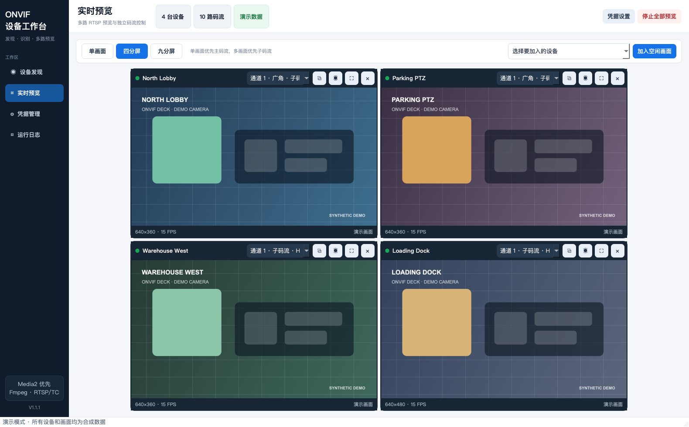
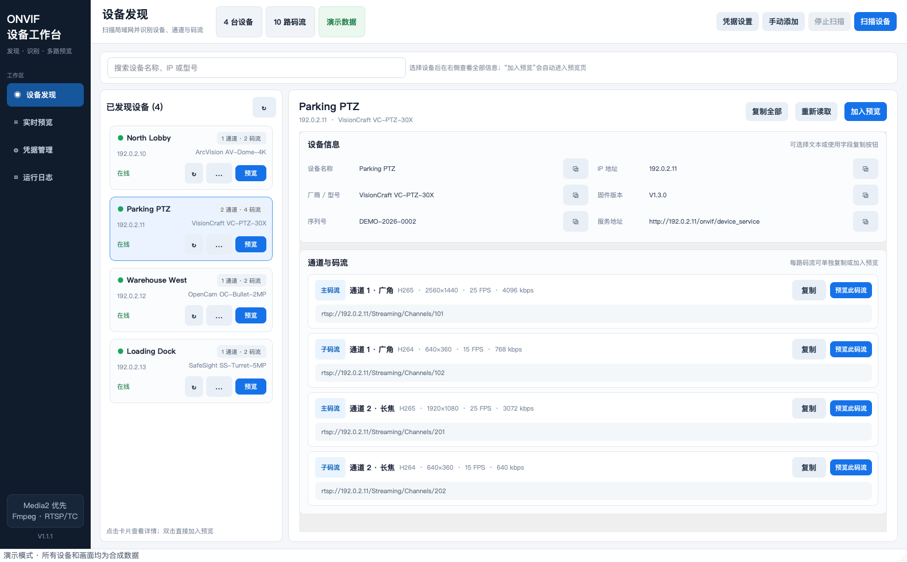
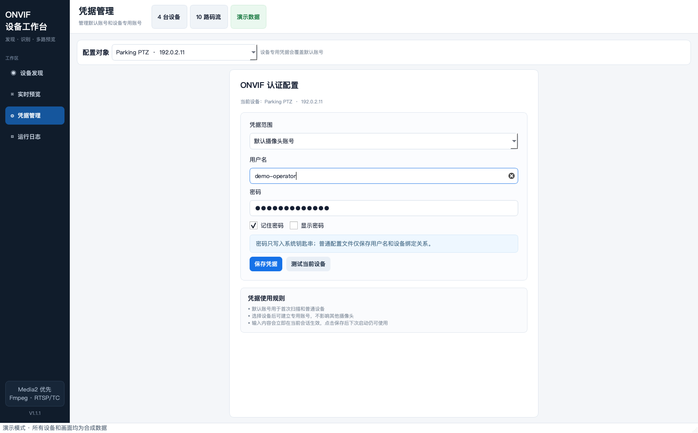
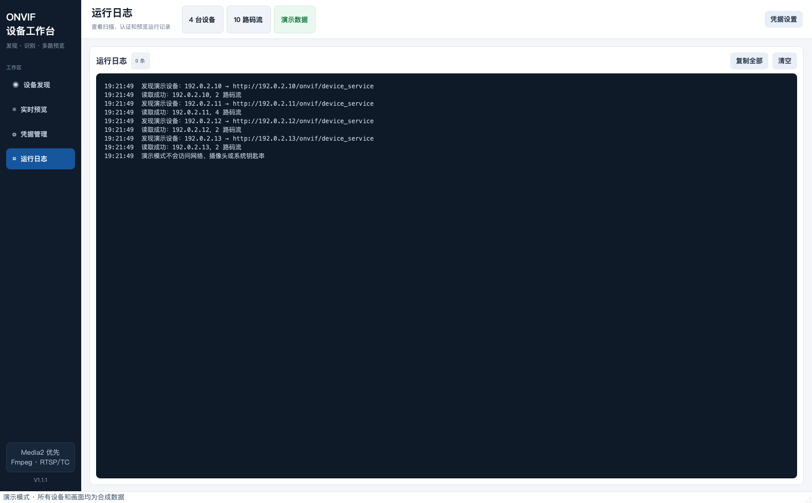

<div align="center">

# ONVIF Deck

**在一个桌面工作区中发现 ONVIF 摄像头、检查全部媒体 Profile，并同时预览多路 RTSP 码流。**

[](https://github.com/IceBigPig/ONVIF-Deck/actions/workflows/ci.yml)
[](https://www.python.org/)
[](https://doc.qt.io/qtforpython-6/)
[](LICENSE)

[English](README.md) · **简体中文**

</div>



> 仓库中的截图全部使用文档专用 IP 和合成视频画面，不包含任何真实摄像头、序列号、账号密码或私人场景。

## Apple 芯片版下载

已经提供可直接运行的 macOS Apple Silicon 版本，支持 M1、M2、M3、M4
及后续 Apple 芯片，最低系统版本为 macOS 11：

- [下载 DMG 安装包](https://github.com/IceBigPig/ONVIF-Deck/releases/download/v1.1.1/ONVIF-Deck-v1.1.1-macOS-arm64.dmg)
- [下载 ZIP 压缩包](https://github.com/IceBigPig/ONVIF-Deck/releases/download/v1.1.1/ONVIF-Deck-v1.1.1-macOS-arm64.zip)
- [版本说明与校验值](docs/releases/v1.1.1.md)

当前首个二进制版本使用临时签名，尚未经过 Apple 公证。如果首次启动时被
macOS 阻止，请按住 Control 点击应用，选择“打开”，然后再次确认“打开”。
该操作通常只需执行一次。

## 主要功能

- 使用 WS-Discovery 扫描所有活动 IPv4 网卡；
- 支持通过 IP、主机和端口或完整 Device Service URL 手动添加设备；
- 读取设备信息以及 ONVIF Media1、Media2 Profile；
- 按 `VideoSourceToken` 识别多传感器、多镜头和多通道设备；
- 在每个视频源内识别主码流、子码流和辅助码流；
- 展示编码、分辨率、帧率、码率、通道和 RTSP URI；
- 支持单画面、四分屏和九分屏，每个窗口可以独立切换码流；
- 保持视频原始宽高比，不拉伸、不裁切；
- FFmpeg 拉流运行在独立线程和子进程中，并带有连接超时，不阻塞界面；
- 密码保存在操作系统凭据库，不写入普通设置文件；
- 所有设备信息均可选择和复制，也可复制包含当前设备凭据的 RTSP URL。

## 界面截图

### 设备发现与 Profile 检查



### 凭据管理



### 可复制运行日志



## 环境要求

- Python 3.10–3.13；
- macOS、Windows，或带桌面环境的 Linux；
- 摄像头与电脑网络互通，并且已经启用 ONVIF；
- 摄像头中已经创建 ONVIF 用户。

ONVIF Deck 优先使用系统 FFmpeg；系统未安装时使用 `imageio-ffmpeg` 提供的 FFmpeg。

## 安装运行

```bash
git clone https://github.com/IceBigPig/ONVIF-Deck.git
cd ONVIF-Deck

python3 -m venv .venv
source .venv/bin/activate          # Windows: .venv\Scripts\activate
python -m pip install --upgrade pip
python -m pip install -e .
onvif-deck
```

也可以直接运行源码：

```bash
python -m pip install -r requirements.txt
python run.py
```

## 使用流程

1. 打开“凭据管理”，填写默认 ONVIF 用户名和密码；
2. 如需下次自动读取，勾选“记住密码”并保存到系统凭据库；
3. 点击“扫描设备”，不响应 WS-Discovery 的设备可以手动添加；
4. 选择设备，查看设备信息、通道、Profile 和 RTSP URI；
5. 将整台设备或指定码流加入预览墙；
6. 切换单画面、四分屏或九分屏，并在任意预览窗口独立切换码流。

部分厂商的网页管理账号不等于 ONVIF 账号。如果认证失败，请先在摄像头后台启用 ONVIF，并创建专用 ONVIF 用户。

## 凭据与 URL 复制安全

- macOS 使用“钥匙串访问”，Windows 使用“凭据管理器”，Linux 使用可用的 Secret Service / Keyring 后端；
- 普通设置只保存用户名、凭据名称和设备绑定关系，不保存明文密码；
- RTSP 地址在界面中保持脱敏；
- 根据工具设计，复制 RTSP URL 时会自动加入当前设备账号密码并进行 URL 编码，便于直接粘贴到播放器；
- 因此剪贴板中的 RTSP URL 包含明文凭据。使用后请及时覆盖剪贴板，禁止把它粘贴到 Issue、日志或聊天记录中。

安全报告与部署注意事项见 [SECURITY.md](SECURITY.md)。

## 码流识别规则

- **通道 / 镜头：** 按 `VideoSourceConfiguration.SourceToken` 分组，每个不同 Token 视为独立传感器或视频源；
- **主 / 子码流：** 只在同一个视频源内排序。像素数最高的标记为主码流，最低的标记为子码流，中间项标记为辅助码流；
- **长焦 / 广角：** ONVIF 没有统一焦段字段。只有 Profile、Source、Encoder 或 Token 名称明确包含 `tele`、`zoom`、`wide`、`panorama` 等词语时才显示提示。

## 开发与测试

```bash
python -m pip install -e ".[dev]"
ruff check src tests scripts
pytest -q
```

启动不访问网络的脱敏演示环境：

```bash
python scripts/demo.py --page preview
```

重新生成全部文档截图：

```bash
python scripts/demo.py --capture-dir docs/images
```

打包说明见 [docs/BUILDING.md](docs/BUILDING.md)。

## 协议说明与边界

- WS-Discovery 使用 UDP 组播 `239.255.255.250:3702`，防火墙、访客 Wi-Fi、AP 隔离和 VLAN 都可能阻止扫描；
- 部分厂商会返回不完整 Profile、临时 RTSP URI 或私有通道规则，工具会保留可读取信息并显示具体错误；
- 工具只调用只读 ONVIF 接口，不修改设备配置；
- 为兼容局域网嵌入式设备常见的自签名证书，当前不校验摄像头 TLS 证书。不要手动添加不可信公网 URL；
- 实际预览路数取决于电脑解码性能、摄像头连接数限制和网络带宽，多分屏模式会优先选择子码流。

## 参与贡献

欢迎提交 Issue 和 Pull Request。请先阅读 [CONTRIBUTING.md](CONTRIBUTING.md)，并确保诊断信息和截图中不包含账号密码、公网 IP、序列号、人脸或私人场景。

## 开源许可

ONVIF Deck 使用 [MIT License](LICENSE)。

ONVIF 是 ONVIF, Inc. 的商标。本项目为独立开源项目，与 ONVIF, Inc. 没有关联或背书关系。
